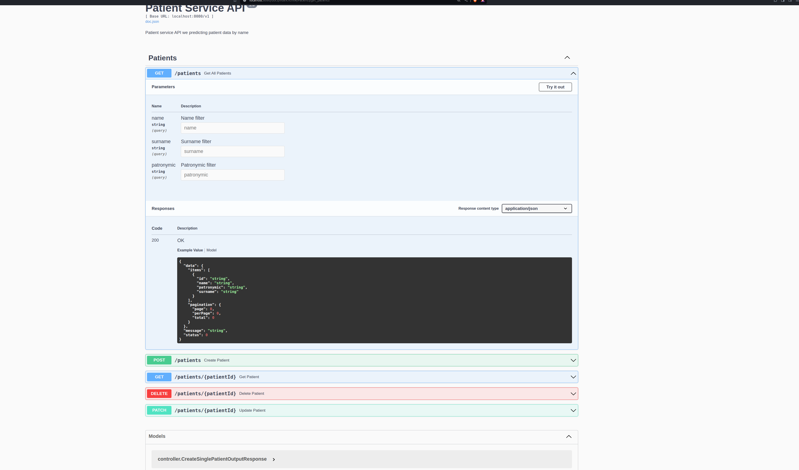

# Patient API

#### 1. I used Gin for routing,
#### 2. ent ORM and migrations
#### 3. I added swagger for API Documentation
#### 4. I have integrated Go Air for auto-reload

## Start up

#### Create local.env and start the application

#### install atlas cli on linux to be able execute migrations 
```curl -sSf https://atlasgo.sh | sh```


### execute migration       
```make apply```

###  Start project with auto-reload
 ```air```

## API Docs
[Swagger](http://localhost:8080/docs/index.html)

